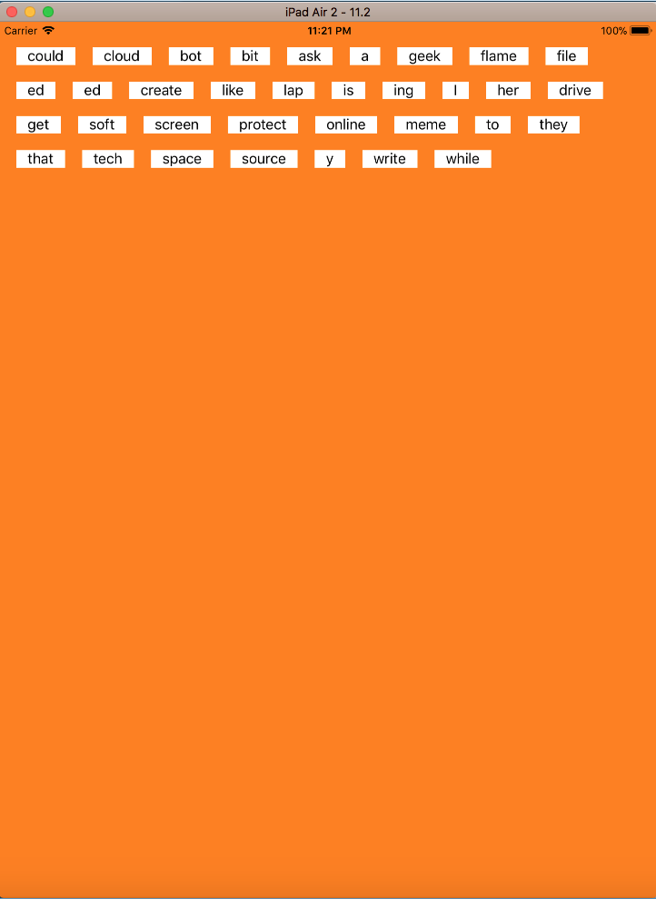
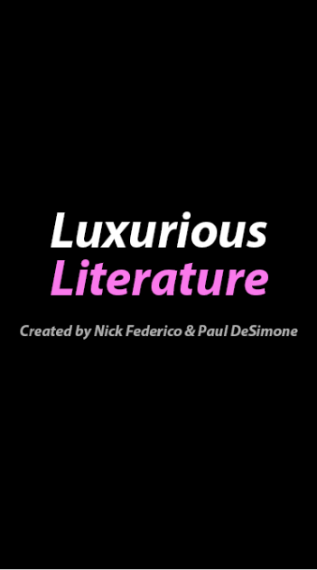
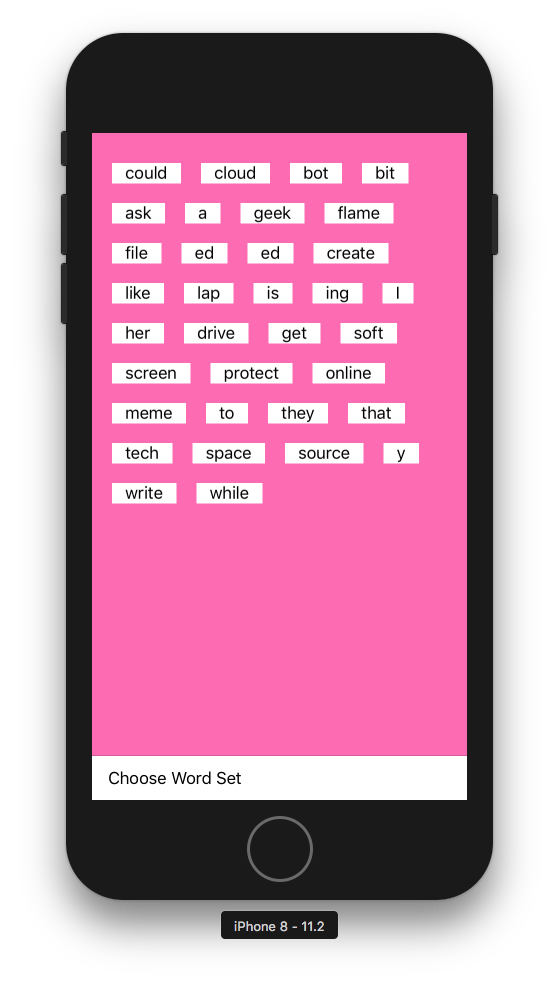
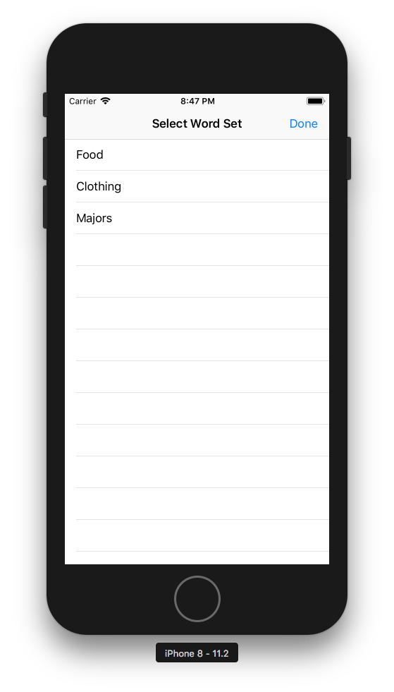

# Luxurious Literature
Paul DeSimone & Nick Federico

An interactive word based design app.

## Features (Proposed)

1. Grab and drag words onto a canvas
2. Word collections in a draggable "gutter"
3. Save/Delete Images
4. Customize background, color, size, etc.

## Checkpoint 1

### Initial Sketches

The goal is to create a word app that will allow uses to express themselves using many different customizable features.

User interaction with the pan gesture is working, in addition to positioning words in an ordered format along the top. This app is currently working on iPhone/iPad.

### Current Features

1. Words can be dragged (automatically align on startup)
2. Launch Screen and App Icons

## Checkpoint 2

This checkpoint we added a table window where you are able to select different word lists. Once the user does so, 
the previous list is erased from the canvas. The application now displays the correct name on the home screen. 
The staus bar is now hidden.

